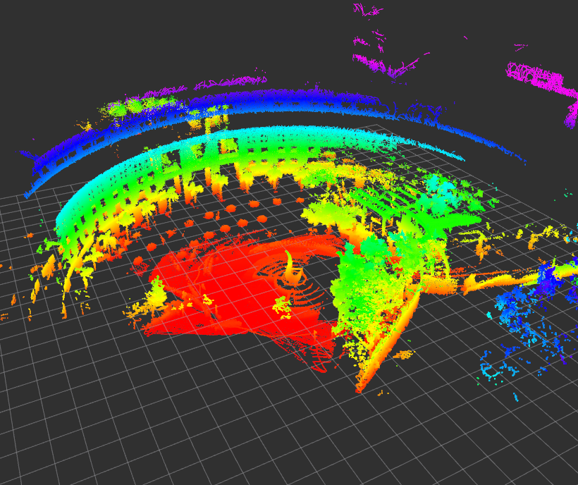
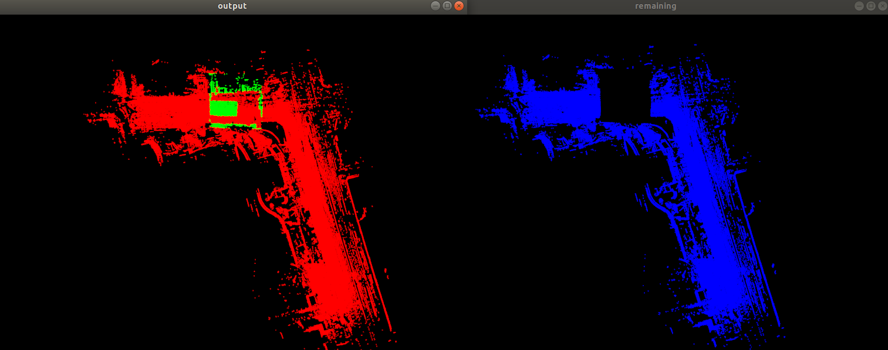

# ikd-Tree
**ikd-Tree** is an incremental k-d tree designed for robotic applications. The ikd-Tree incrementally updates a k-d tree with new coming points only, leading to much lower computation time than existing static k-d trees. Besides point-wise operations, the ikd-Tree supports several features such as box-wise operations and down-sampling that are practically useful in robotic applications.


### Developers

[Yixi Cai 蔡逸熙](https://github.com/Ecstasy-EC): Data structure design and implementation

[Wei Xu 徐威](https://github.com/XW-HKU): Incorporation into LiDAR-inertial odometry package ([FAST_LIO2 Released](https://github.com/hku-mars/FAST_LIO))

More details please refer to our paper and video~


### Related paper

**Related paper** available on arxiv:

[ikd-Tree: An Incremental K-D Tree for robotic applications](https://arxiv.org/abs/2102.10808)

**Related video**: https://youtu.be/ueOunk03zxA


## Version 2

- We upgraded our **ikd-Tree** to achieve a more stable and efficient performance. More details are shown as follows:
  - Replace the queue and priority queue in STL with our code to avoid memory conflicts.
  - Fix some bugs in re-building of the previous version, which may result in information loss during the multi-thread re-building process. 
  - Add a new parameter `max_dist` to support ranged search to achieve faster nearest search in robotic applications.
  - Fix minor bugs to improve the overall performance. 


## Build & Run demo
### 1. How to build this project
```
cd ~/catkin_ws/src
git clone git@github.com:hku-mars/ikd-Tree.git
cd ikd-Tree/build
cmake ..
make -j 9
cd ../materials
wget https://urserver.kaist.ac.kr/publicdata/ikd-tree/large_scale_map.pcd
```
### 2. Run our examples

```
cd ${Your own directory}/ikd-Tree/build
# Example 1. Check the speed of ikd-Tree
./ikd_tree_demo
# Example 2. Searching-points-by-box examples
./search_points_by_box
# Example 3. An aysnc. exmaple for readers' better understanding of the principle of ikd-Tree
./ikd_tree_async_demo
```

Then, you can show the visualized examples as follows!

Input (HKUST's Red Bird Sundial) |  Output of Example 2
:-------------------------:|:-------------------------:
 |  

Input (A large scale map) |  Output of Example 3
:-------------------------:|:-------------------------:
 |  
